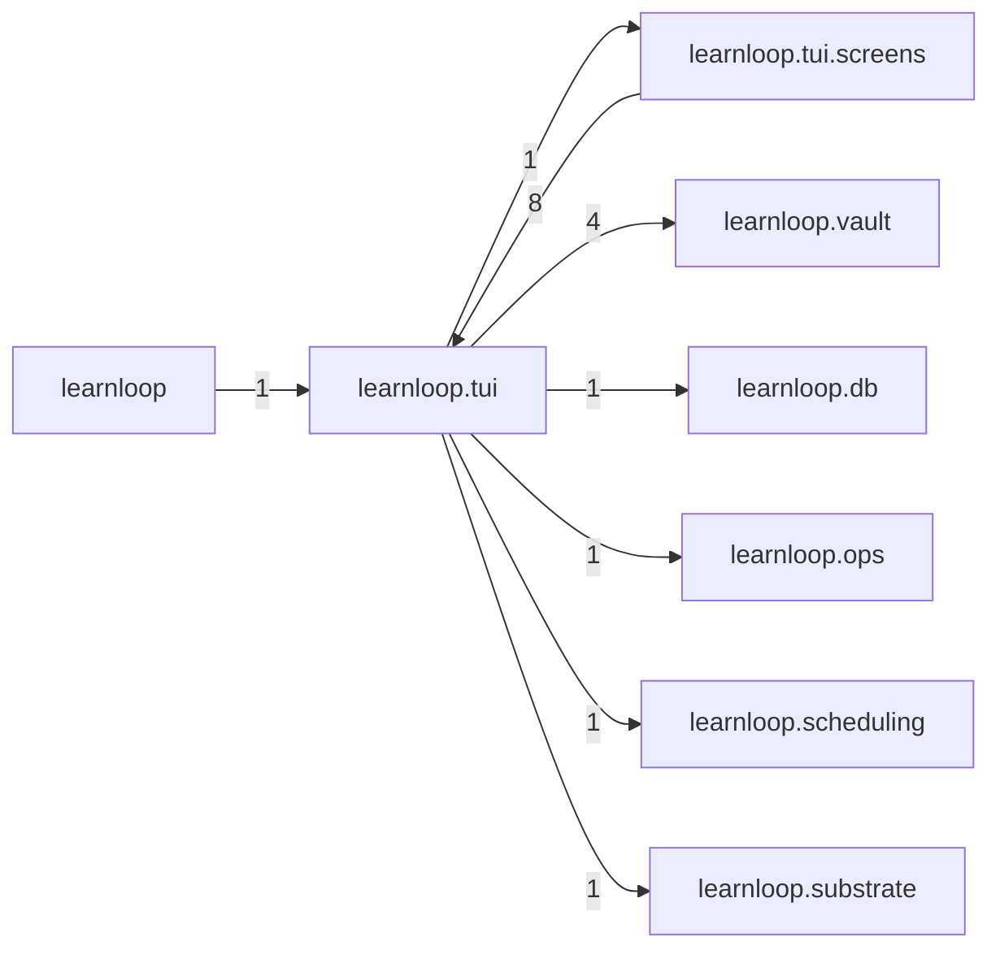

# `learnloop.tui` package map

> [!info] Generated package map
> This map is generated from live modules and their static imports. Follow module links for source-level facts and canonical concept/workflow links for system behavior.

Up: [[Module Catalog]]

## Responsibility

Textual UI adapter, screens, widgets, state, and presentation behavior.

For system intent, use [[Architecture Overview]].

^package-purpose

## Module index

| Module | Purpose | Status | Direct importers | Direct test files |
|---|---|---:|---:|---:|
| [[Reference/Modules/learnloop/tui/__init__|learnloop.tui]] | [[Reference/Modules/learnloop/tui/__init__#^module-purpose|purpose]] | `ACTIVE` | 0 | 0 |
| [[Reference/Modules/learnloop/tui/app|learnloop.tui.app]] | [[Reference/Modules/learnloop/tui/app#^module-purpose|purpose]] | `ACTIVE` | 1 | 6 |
| [[Reference/Modules/learnloop/tui/state|learnloop.tui.state]] | [[Reference/Modules/learnloop/tui/state#^module-purpose|purpose]] | `ACTIVE` | 5 | 0 |
| [[Reference/Modules/learnloop/tui/theme|learnloop.tui.theme]] | [[Reference/Modules/learnloop/tui/theme#^module-purpose|purpose]] | `ACTIVE` | 1 | 0 |
| [[Reference/Modules/learnloop/tui/widgets|learnloop.tui.widgets]] | [[Reference/Modules/learnloop/tui/widgets#^module-purpose|purpose]] | `ACTIVE` | 5 | 2 |

## Child package maps

- [[Reference/Modules/learnloop/tui/screens/_package|learnloop.tui.screens]] — Individual Textual user-interface screens.

## Cross-package dependencies

### This package imports

- [[Reference/Modules/learnloop/vault/_package|learnloop.vault]] — 4 static module edges
- [[Reference/Modules/learnloop/db/_package|learnloop.db]] — 1 static module edge
- [[Reference/Modules/learnloop/ops/_package|learnloop.ops]] — 1 static module edge
- [[Reference/Modules/learnloop/scheduling/_package|learnloop.scheduling]] — 1 static module edge
- [[Reference/Modules/learnloop/substrate/_package|learnloop.substrate]] — 1 static module edge
- [[Reference/Modules/learnloop/tui/screens/_package|learnloop.tui.screens]] — 1 static module edge

### Packages that import this package

- [[Reference/Modules/learnloop/tui/screens/_package|learnloop.tui.screens]] — 8 static module edges
- [[Reference/Modules/learnloop/_package|learnloop]] — 1 static module edge

### Dependency neighborhood

This diagram compresses package-level static imports; edge labels are distinct module-to-module import counts.



Interpretation: arrow direction is static import direction and the label is the number of distinct module-to-module edges. It shows coupling pressure, not runtime call frequency or ownership permission.

## Workflow entry points

- [[Start a Learning Cycle]]
- [[Inspect Persistent State]]

## Find and filter

Use Obsidian's native search:

```query
path:"Reference/Modules/learnloop/tui" tag:#docs/module
```

To change this package, start with a module's [[#Module index|purpose link]], then follow its callers, tests, and modification guidance. Re-run the generator after source changes.
