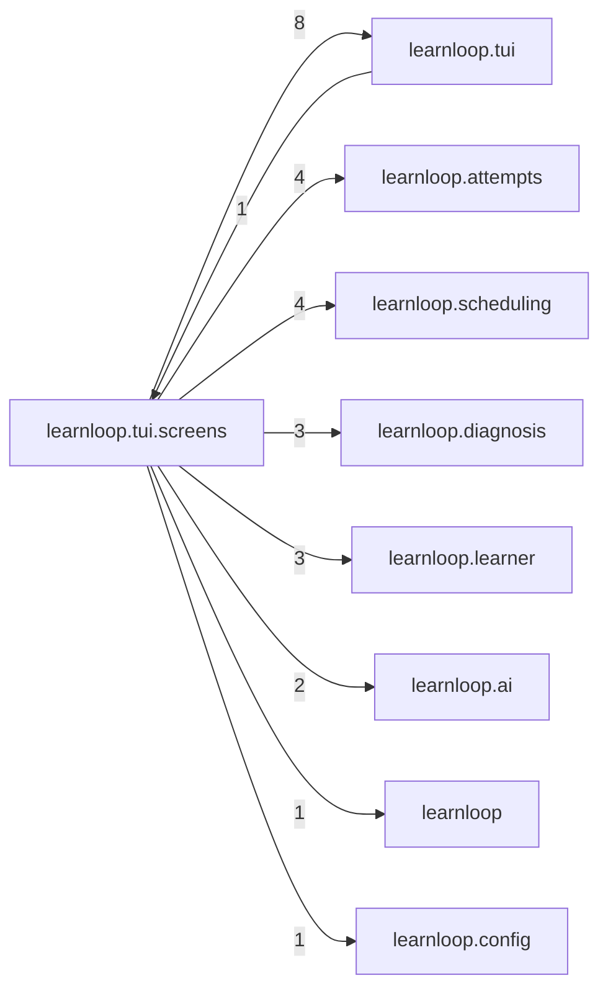

# `learnloop.tui.screens` package map

> [!info] Generated package map
> This map is generated from live modules and their static imports. Follow module links for source-level facts and canonical concept/workflow links for system behavior.

Up: [[Module Catalog]]

## Responsibility

Individual Textual user-interface screens.

For system intent, use [[Architecture Overview]].

^package-purpose

## Module index

| Module | Purpose | Status | Direct importers | Direct test files |
|---|---|---:|---:|---:|
| [[Reference/Modules/learnloop/tui/screens/__init__|learnloop.tui.screens]] | [[Reference/Modules/learnloop/tui/screens/__init__#^module-purpose|purpose]] | `ACTIVE` | 0 | 0 |
| [[Reference/Modules/learnloop/tui/screens/feedback|learnloop.tui.screens.feedback]] | [[Reference/Modules/learnloop/tui/screens/feedback#^module-purpose|purpose]] | `ACTIVE` | 1 | 4 |
| [[Reference/Modules/learnloop/tui/screens/practice|learnloop.tui.screens.practice]] | [[Reference/Modules/learnloop/tui/screens/practice#^module-purpose|purpose]] | `ACTIVE` | 1 | 3 |
| [[Reference/Modules/learnloop/tui/screens/start|learnloop.tui.screens.start]] | [[Reference/Modules/learnloop/tui/screens/start#^module-purpose|purpose]] | `ACTIVE` | 1 | 2 |
| [[Reference/Modules/learnloop/tui/screens/today|learnloop.tui.screens.today]] | [[Reference/Modules/learnloop/tui/screens/today#^module-purpose|purpose]] | `ACTIVE` | 2 | 3 |

## Cross-package dependencies

### This package imports

- [[Reference/Modules/learnloop/tui/_package|learnloop.tui]] — 8 static module edges
- [[Reference/Modules/learnloop/attempts/_package|learnloop.attempts]] — 4 static module edges
- [[Reference/Modules/learnloop/scheduling/_package|learnloop.scheduling]] — 4 static module edges
- [[Reference/Modules/learnloop/diagnosis/_package|learnloop.diagnosis]] — 3 static module edges
- [[Reference/Modules/learnloop/learner/_package|learnloop.learner]] — 3 static module edges
- [[Reference/Modules/learnloop/ai/_package|learnloop.ai]] — 2 static module edges
- [[Reference/Modules/learnloop/_package|learnloop]] — 1 static module edge
- [[Reference/Modules/learnloop/config/_package|learnloop.config]] — 1 static module edge

### Packages that import this package

- [[Reference/Modules/learnloop/tui/_package|learnloop.tui]] — 1 static module edge

### Dependency neighborhood

This diagram compresses package-level static imports; edge labels are distinct module-to-module import counts.



Interpretation: arrow direction is static import direction and the label is the number of distinct module-to-module edges. It shows coupling pressure, not runtime call frequency or ownership permission.

## Workflow entry points

- [[Start a Learning Cycle]]
- [[Inspect Persistent State]]

## Find and filter

Use Obsidian's native search:

```query
path:"Reference/Modules/learnloop/tui/screens" tag:#docs/module
```

To change this package, start with a module's [[#Module index|purpose link]], then follow its callers, tests, and modification guidance. Re-run the generator after source changes.
