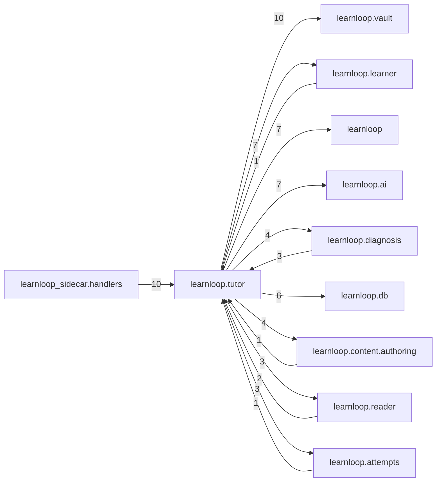

# `learnloop.tutor` package map

> [!info] Generated package map
> This map is generated from live modules and their static imports. Follow module links for source-level facts and canonical concept/workflow links for system behavior.

Up: [[Module Catalog]]

## Responsibility

Tutoring, hints, teach-back, and tutor question-and-answer workflows.

For system intent, use [[Learning System]], [[AI Architecture]].

^package-purpose

## Module index

| Module | Purpose | Status | Direct importers | Direct test files |
|---|---|---:|---:|---:|
| [[Reference/Modules/learnloop/tutor/__init__|learnloop.tutor]] | [[Reference/Modules/learnloop/tutor/__init__#^module-purpose|purpose]] | `ACTIVE` | 0 | 0 |
| [[Reference/Modules/learnloop/tutor/ai_contracts|learnloop.tutor.ai_contracts]] | [[Reference/Modules/learnloop/tutor/ai_contracts#^module-purpose|purpose]] | `ACTIVE` | 5 | 15 |
| [[Reference/Modules/learnloop/tutor/durable_promotion|learnloop.tutor.durable_promotion]] | [[Reference/Modules/learnloop/tutor/durable_promotion#^module-purpose|purpose]] | `ACTIVE` | 5 | 1 |
| [[Reference/Modules/learnloop/tutor/promotions|learnloop.tutor.promotions]] | [[Reference/Modules/learnloop/tutor/promotions#^module-purpose|purpose]] | `ACTIVE` | 4 | 3 |
| [[Reference/Modules/learnloop/tutor/question_queue|learnloop.tutor.question_queue]] | [[Reference/Modules/learnloop/tutor/question_queue#^module-purpose|purpose]] | `ACTIVE` | 2 | 1 |
| [[Reference/Modules/learnloop/tutor/question_signal|learnloop.tutor.question_signal]] | [[Reference/Modules/learnloop/tutor/question_signal#^module-purpose|purpose]] | `ACTIVE` | 1 | 3 |
| [[Reference/Modules/learnloop/tutor/teach_back|learnloop.tutor.teach_back]] | [[Reference/Modules/learnloop/tutor/teach_back#^module-purpose|purpose]] | `ACTIVE` | 5 | 3 |
| [[Reference/Modules/learnloop/tutor/tutor_qa|learnloop.tutor.tutor_qa]] | [[Reference/Modules/learnloop/tutor/tutor_qa#^module-purpose|purpose]] | `ACTIVE` | 7 | 9 |

## Cross-package dependencies

### This package imports

- [[Reference/Modules/learnloop/vault/_package|learnloop.vault]] — 10 static module edges
- [[Reference/Modules/learnloop/_package|learnloop]] — 7 static module edges
- [[Reference/Modules/learnloop/ai/_package|learnloop.ai]] — 7 static module edges
- [[Reference/Modules/learnloop/learner/_package|learnloop.learner]] — 7 static module edges
- [[Reference/Modules/learnloop/db/_package|learnloop.db]] — 6 static module edges
- [[Reference/Modules/learnloop/content/authoring/_package|learnloop.content.authoring]] — 4 static module edges
- [[Reference/Modules/learnloop/diagnosis/_package|learnloop.diagnosis]] — 4 static module edges
- [[Reference/Modules/learnloop/attempts/_package|learnloop.attempts]] — 3 static module edges
- [[Reference/Modules/learnloop/reader/_package|learnloop.reader]] — 3 static module edges
- [[Reference/Modules/learnloop/config/_package|learnloop.config]] — 2 static module edges
- [[Reference/Modules/learnloop/content/proposals/_package|learnloop.content.proposals]] — 2 static module edges
- [[Reference/Modules/learnloop/goals/_package|learnloop.goals]] — 2 static module edges

### Packages that import this package

- [[Reference/Modules/learnloop_sidecar/handlers/_package|learnloop_sidecar.handlers]] — 10 static module edges
- [[Reference/Modules/learnloop/diagnosis/_package|learnloop.diagnosis]] — 3 static module edges
- [[Reference/Modules/learnloop/cli/_package|learnloop.cli]] — 2 static module edges
- [[Reference/Modules/learnloop/reader/_package|learnloop.reader]] — 2 static module edges
- [[Reference/Modules/learnloop/sim/_package|learnloop.sim]] — 2 static module edges
- [[Reference/Modules/learnloop/attempts/_package|learnloop.attempts]] — 1 static module edge
- [[Reference/Modules/learnloop/content/authoring/_package|learnloop.content.authoring]] — 1 static module edge
- [[Reference/Modules/learnloop/content/pipeline/_package|learnloop.content.pipeline]] — 1 static module edge
- [[Reference/Modules/learnloop/learner/_package|learnloop.learner]] — 1 static module edge

### Dependency neighborhood

This diagram compresses package-level static imports; edge labels are distinct module-to-module import counts.



Interpretation: arrow direction is static import direction and the label is the number of distinct module-to-module edges. It shows coupling pressure, not runtime call frequency or ownership permission.

## Workflow entry points

- [[Start a Learning Cycle]]
- [[Process Model Output]]

## Find and filter

Use Obsidian's native search:

```query
path:"Reference/Modules/learnloop/tutor" tag:#docs/module
```

To change this package, start with a module's [[#Module index|purpose link]], then follow its callers, tests, and modification guidance. Re-run the generator after source changes.
