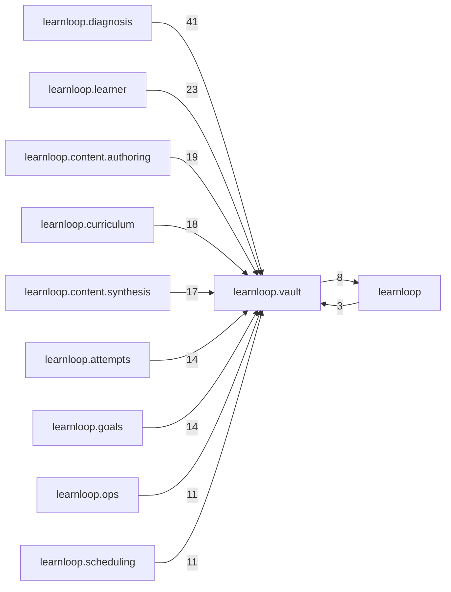

# `learnloop.vault` package map

> [!info] Generated package map
> This map is generated from live modules and their static imports. Follow module links for source-level facts and canonical concept/workflow links for system behavior.

Up: [[Module Catalog]]

## Responsibility

Filesystem layout, Markdown/YAML I/O, hashes, models, loading, and writing.

For system intent, use [[State and Persistence]].

^package-purpose

## Module index

| Module | Purpose | Status | Direct importers | Direct test files |
|---|---|---:|---:|---:|
| [[Reference/Modules/learnloop/vault/__init__|learnloop.vault]] | [[Reference/Modules/learnloop/vault/__init__#^module-purpose|purpose]] | `ACTIVE` | 0 | 0 |
| [[Reference/Modules/learnloop/vault/facet_fingerprint|learnloop.vault.facet_fingerprint]] | [[Reference/Modules/learnloop/vault/facet_fingerprint#^module-purpose|purpose]] | `ACTIVE` | 3 | 1 |
| [[Reference/Modules/learnloop/vault/hashes|learnloop.vault.hashes]] | [[Reference/Modules/learnloop/vault/hashes#^module-purpose|purpose]] | `ACTIVE` | 4 | 1 |
| [[Reference/Modules/learnloop/vault/loader|learnloop.vault.loader]] | [[Reference/Modules/learnloop/vault/loader#^module-purpose|purpose]] | `ACTIVE` | 39 | 280 |
| [[Reference/Modules/learnloop/vault/models|learnloop.vault.models]] | [[Reference/Modules/learnloop/vault/models#^module-purpose|purpose]] | `ACTIVE` | 147 | 29 |
| [[Reference/Modules/learnloop/vault/paths|learnloop.vault.paths]] | [[Reference/Modules/learnloop/vault/paths#^module-purpose|purpose]] | `ACTIVE` | 35 | 40 |
| [[Reference/Modules/learnloop/vault/repository|learnloop.vault.repository]] | [[Reference/Modules/learnloop/vault/repository#^module-purpose|purpose]] | `ACTIVE` | 4 | 1 |
| [[Reference/Modules/learnloop/vault/writer|learnloop.vault.writer]] | [[Reference/Modules/learnloop/vault/writer#^module-purpose|purpose]] | `ACTIVE` | 16 | 69 |
| [[Reference/Modules/learnloop/vault/yaml_io|learnloop.vault.yaml_io]] | [[Reference/Modules/learnloop/vault/yaml_io#^module-purpose|purpose]] | `ACTIVE` | 17 | 73 |

## Cross-package dependencies

### This package imports

- [[Reference/Modules/learnloop/_package|learnloop]] — 8 static module edges
- [[Reference/Modules/learnloop/config/_package|learnloop.config]] — 3 static module edges
- [[Reference/Modules/learnloop/db/_package|learnloop.db]] — 1 static module edge
- [[Reference/Modules/learnloop/ingest/_package|learnloop.ingest]] — 1 static module edge

### Packages that import this package

- [[Reference/Modules/learnloop/diagnosis/_package|learnloop.diagnosis]] — 41 static module edges
- [[Reference/Modules/learnloop/learner/_package|learnloop.learner]] — 23 static module edges
- [[Reference/Modules/learnloop/content/authoring/_package|learnloop.content.authoring]] — 19 static module edges
- [[Reference/Modules/learnloop/curriculum/_package|learnloop.curriculum]] — 18 static module edges
- [[Reference/Modules/learnloop/content/synthesis/_package|learnloop.content.synthesis]] — 17 static module edges
- [[Reference/Modules/learnloop/attempts/_package|learnloop.attempts]] — 14 static module edges
- [[Reference/Modules/learnloop/goals/_package|learnloop.goals]] — 14 static module edges
- [[Reference/Modules/learnloop/ops/_package|learnloop.ops]] — 11 static module edges
- [[Reference/Modules/learnloop/scheduling/_package|learnloop.scheduling]] — 11 static module edges
- [[Reference/Modules/learnloop/content/proposals/_package|learnloop.content.proposals]] — 10 static module edges
- [[Reference/Modules/learnloop/substrate/_package|learnloop.substrate]] — 10 static module edges
- [[Reference/Modules/learnloop/tutor/_package|learnloop.tutor]] — 10 static module edges
- [[Reference/Modules/learnloop/cli/_package|learnloop.cli]] — 9 static module edges
- [[Reference/Modules/learnloop/content/pipeline/_package|learnloop.content.pipeline]] — 9 static module edges
- [[Reference/Modules/learnloop/sim/_package|learnloop.sim]] — 8 static module edges
- [[Reference/Modules/learnloop_sidecar/handlers/_package|learnloop_sidecar.handlers]] — 7 static module edges
- [[Reference/Modules/learnloop/reader/_package|learnloop.reader]] — 6 static module edges
- [[Reference/Modules/learnloop_sidecar/_package|learnloop_sidecar]] — 5 static module edges
- [[Reference/Modules/learnloop/content/sources/_package|learnloop.content.sources]] — 4 static module edges
- [[Reference/Modules/learnloop/tui/_package|learnloop.tui]] — 4 static module edges
- [[Reference/Modules/learnloop/_package|learnloop]] — 3 static module edges
- [[Reference/Modules/learnloop/params/_package|learnloop.params]] — 1 static module edge
- [[Reference/Modules/learnloop/substrate/compat/_package|learnloop.substrate.compat]] — 1 static module edge

### Dependency neighborhood

This diagram compresses package-level static imports; edge labels are distinct module-to-module import counts.



Interpretation: arrow direction is static import direction and the label is the number of distinct module-to-module edges. It shows coupling pressure, not runtime call frequency or ownership permission.

## Workflow entry points

- [[Initialize a Vault]]
- [[Inspect Persistent State]]

## Find and filter

Use Obsidian's native search:

```query
path:"Reference/Modules/learnloop/vault" tag:#docs/module
```

To change this package, start with a module's [[#Module index|purpose link]], then follow its callers, tests, and modification guidance. Re-run the generator after source changes.
