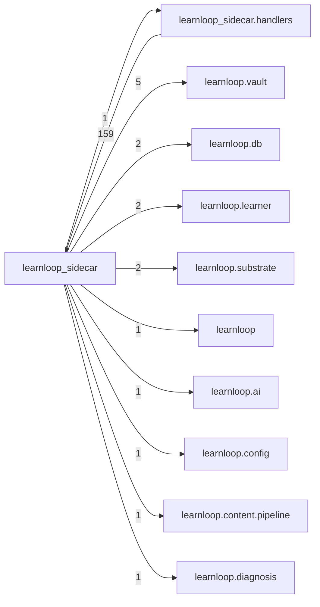

# `learnloop_sidecar` package map

> [!info] Generated package map
> This map is generated from live modules and their static imports. Follow module links for source-level facts and canonical concept/workflow links for system behavior.

Up: [[Module Catalog]]

## Responsibility

Desktop sidecar process, RPC registry, transport context, DTOs, and server lifecycle.

For system intent, use [[Architecture Overview]].

^package-purpose

## Module index

| Module | Purpose | Status | Direct importers | Direct test files |
|---|---|---:|---:|---:|
| [[Reference/Modules/learnloop_sidecar/__init__|learnloop_sidecar]] | [[Reference/Modules/learnloop_sidecar/__init__#^module-purpose|purpose]] | `ACTIVE` | 1 | 0 |
| [[Reference/Modules/learnloop_sidecar/__main__|learnloop_sidecar.__main__]] | [[Reference/Modules/learnloop_sidecar/__main__#^module-purpose|purpose]] | `ACTIVE` | 0 | 0 |
| [[Reference/Modules/learnloop_sidecar/context|learnloop_sidecar.context]] | [[Reference/Modules/learnloop_sidecar/context#^module-purpose|purpose]] | `ACTIVE` | 41 | 18 |
| [[Reference/Modules/learnloop_sidecar/dto|learnloop_sidecar.dto]] | [[Reference/Modules/learnloop_sidecar/dto#^module-purpose|purpose]] | `ACTIVE` | 42 | 4 |
| [[Reference/Modules/learnloop_sidecar/errors|learnloop_sidecar.errors]] | [[Reference/Modules/learnloop_sidecar/errors#^module-purpose|purpose]] | `ACTIVE` | 37 | 11 |
| [[Reference/Modules/learnloop_sidecar/exam_grading|learnloop_sidecar.exam_grading]] | [[Reference/Modules/learnloop_sidecar/exam_grading#^module-purpose|purpose]] | `ACTIVE` | 1 | 0 |
| [[Reference/Modules/learnloop_sidecar/logging|learnloop_sidecar.logging]] | [[Reference/Modules/learnloop_sidecar/logging#^module-purpose|purpose]] | `ACTIVE` | 6 | 0 |
| [[Reference/Modules/learnloop_sidecar/registry|learnloop_sidecar.registry]] | [[Reference/Modules/learnloop_sidecar/registry#^module-purpose|purpose]] | `ACTIVE` | 40 | 13 |
| [[Reference/Modules/learnloop_sidecar/server|learnloop_sidecar.server]] | [[Reference/Modules/learnloop_sidecar/server#^module-purpose|purpose]] | `ACTIVE` | 1 | 28 |

## Child package maps

- [[Reference/Modules/learnloop_sidecar/handlers/_package|learnloop_sidecar.handlers]] — RPC adapters that validate requests and delegate to domain and infrastructure APIs.

## Cross-package dependencies

### This package imports

- [[Reference/Modules/learnloop/vault/_package|learnloop.vault]] — 5 static module edges
- [[Reference/Modules/learnloop/db/_package|learnloop.db]] — 2 static module edges
- [[Reference/Modules/learnloop/learner/_package|learnloop.learner]] — 2 static module edges
- [[Reference/Modules/learnloop/substrate/_package|learnloop.substrate]] — 2 static module edges
- [[Reference/Modules/learnloop/_package|learnloop]] — 1 static module edge
- [[Reference/Modules/learnloop/ai/_package|learnloop.ai]] — 1 static module edge
- [[Reference/Modules/learnloop/config/_package|learnloop.config]] — 1 static module edge
- [[Reference/Modules/learnloop/content/pipeline/_package|learnloop.content.pipeline]] — 1 static module edge
- [[Reference/Modules/learnloop/diagnosis/_package|learnloop.diagnosis]] — 1 static module edge
- [[Reference/Modules/learnloop/goals/_package|learnloop.goals]] — 1 static module edge
- [[Reference/Modules/learnloop/ops/_package|learnloop.ops]] — 1 static module edge
- [[Reference/Modules/learnloop_sidecar/handlers/_package|learnloop_sidecar.handlers]] — 1 static module edge

### Packages that import this package

- [[Reference/Modules/learnloop_sidecar/handlers/_package|learnloop_sidecar.handlers]] — 159 static module edges

### Dependency neighborhood

This diagram compresses package-level static imports; edge labels are distinct module-to-module import counts.



Interpretation: arrow direction is static import direction and the label is the number of distinct module-to-module edges. It shows coupling pressure, not runtime call frequency or ownership permission.

## Workflow entry points

- [[Initialize a Vault]]
- [[Start a Learning Cycle]]
- [[Import Canonical Sources]]
- [[Process Model Output]]
- [[Inspect Persistent State]]

## Find and filter

Use Obsidian's native search:

```query
path:"Reference/Modules/learnloop_sidecar" tag:#docs/module
```

To change this package, start with a module's [[#Module index|purpose link]], then follow its callers, tests, and modification guidance. Re-run the generator after source changes.
