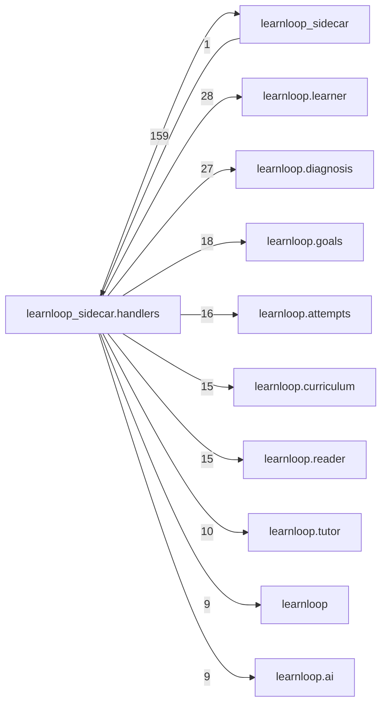

# `learnloop_sidecar.handlers` package map

> [!info] Generated package map
> This map is generated from live modules and their static imports. Follow module links for source-level facts and canonical concept/workflow links for system behavior.

Up: [[Module Catalog]]

## Responsibility

RPC adapters that validate requests and delegate to domain and infrastructure APIs.

For system intent, use [[Architecture Overview]].

^package-purpose

## Module index

| Module | Purpose | Status | Direct importers | Direct test files |
|---|---|---:|---:|---:|
| [[Reference/Modules/learnloop_sidecar/handlers/__init__|learnloop_sidecar.handlers]] | [[Reference/Modules/learnloop_sidecar/handlers/__init__#^module-purpose|purpose]] | `ACTIVE` | 1 | 11 |
| [[Reference/Modules/learnloop_sidecar/handlers/adjudication|learnloop_sidecar.handlers.adjudication]] | [[Reference/Modules/learnloop_sidecar/handlers/adjudication#^module-purpose|purpose]] | `ACTIVE` | 1 | 0 |
| [[Reference/Modules/learnloop_sidecar/handlers/ai_providers|learnloop_sidecar.handlers.ai_providers]] | [[Reference/Modules/learnloop_sidecar/handlers/ai_providers#^module-purpose|purpose]] | `ACTIVE` | 9 | 1 |
| [[Reference/Modules/learnloop_sidecar/handlers/animation|learnloop_sidecar.handlers.animation]] | [[Reference/Modules/learnloop_sidecar/handlers/animation#^module-purpose|purpose]] | `ACTIVE` | 1 | 1 |
| [[Reference/Modules/learnloop_sidecar/handlers/app|learnloop_sidecar.handlers.app]] | [[Reference/Modules/learnloop_sidecar/handlers/app#^module-purpose|purpose]] | `ACTIVE` | 1 | 0 |
| [[Reference/Modules/learnloop_sidecar/handlers/calibration|learnloop_sidecar.handlers.calibration]] | [[Reference/Modules/learnloop_sidecar/handlers/calibration#^module-purpose|purpose]] | `ACTIVE` | 1 | 0 |
| [[Reference/Modules/learnloop_sidecar/handlers/claims|learnloop_sidecar.handlers.claims]] | [[Reference/Modules/learnloop_sidecar/handlers/claims#^module-purpose|purpose]] | `ACTIVE` | 1 | 0 |
| [[Reference/Modules/learnloop_sidecar/handlers/cli|learnloop_sidecar.handlers.cli]] | [[Reference/Modules/learnloop_sidecar/handlers/cli#^module-purpose|purpose]] | `ACTIVE` | 1 | 0 |
| [[Reference/Modules/learnloop_sidecar/handlers/diagnostic|learnloop_sidecar.handlers.diagnostic]] | [[Reference/Modules/learnloop_sidecar/handlers/diagnostic#^module-purpose|purpose]] | `ACTIVE` | 1 | 0 |
| [[Reference/Modules/learnloop_sidecar/handlers/exams|learnloop_sidecar.handlers.exams]] | [[Reference/Modules/learnloop_sidecar/handlers/exams#^module-purpose|purpose]] | `ACTIVE` | 1 | 2 |
| [[Reference/Modules/learnloop_sidecar/handlers/facet_detail|learnloop_sidecar.handlers.facet_detail]] | [[Reference/Modules/learnloop_sidecar/handlers/facet_detail#^module-purpose|purpose]] | `ACTIVE` | 1 | 0 |
| [[Reference/Modules/learnloop_sidecar/handlers/facets|learnloop_sidecar.handlers.facets]] | [[Reference/Modules/learnloop_sidecar/handlers/facets#^module-purpose|purpose]] | `ACTIVE` | 1 | 0 |
| [[Reference/Modules/learnloop_sidecar/handlers/feedback|learnloop_sidecar.handlers.feedback]] | [[Reference/Modules/learnloop_sidecar/handlers/feedback#^module-purpose|purpose]] | `ACTIVE` | 1 | 2 |
| [[Reference/Modules/learnloop_sidecar/handlers/goals|learnloop_sidecar.handlers.goals]] | [[Reference/Modules/learnloop_sidecar/handlers/goals#^module-purpose|purpose]] | `ACTIVE` | 2 | 0 |
| [[Reference/Modules/learnloop_sidecar/handlers/golden_path|learnloop_sidecar.handlers.golden_path]] | [[Reference/Modules/learnloop_sidecar/handlers/golden_path#^module-purpose|purpose]] | `ACTIVE` | 1 | 0 |
| [[Reference/Modules/learnloop_sidecar/handlers/golden_path_assessment|learnloop_sidecar.handlers.golden_path_assessment]] | [[Reference/Modules/learnloop_sidecar/handlers/golden_path_assessment#^module-purpose|purpose]] | `ACTIVE` | 1 | 0 |
| [[Reference/Modules/learnloop_sidecar/handlers/graph|learnloop_sidecar.handlers.graph]] | [[Reference/Modules/learnloop_sidecar/handlers/graph#^module-purpose|purpose]] | `ACTIVE` | 1 | 0 |
| [[Reference/Modules/learnloop_sidecar/handlers/graph_edit|learnloop_sidecar.handlers.graph_edit]] | [[Reference/Modules/learnloop_sidecar/handlers/graph_edit#^module-purpose|purpose]] | `ACTIVE` | 1 | 0 |
| [[Reference/Modules/learnloop_sidecar/handlers/ingest|learnloop_sidecar.handlers.ingest]] | [[Reference/Modules/learnloop_sidecar/handlers/ingest#^module-purpose|purpose]] | `ACTIVE` | 2 | 5 |
| [[Reference/Modules/learnloop_sidecar/handlers/inspector|learnloop_sidecar.handlers.inspector]] | [[Reference/Modules/learnloop_sidecar/handlers/inspector#^module-purpose|purpose]] | `ACTIVE` | 1 | 0 |
| [[Reference/Modules/learnloop_sidecar/handlers/item_authoring|learnloop_sidecar.handlers.item_authoring]] | [[Reference/Modules/learnloop_sidecar/handlers/item_authoring#^module-purpose|purpose]] | `ACTIVE` | 1 | 0 |
| [[Reference/Modules/learnloop_sidecar/handlers/knowledge_map|learnloop_sidecar.handlers.knowledge_map]] | [[Reference/Modules/learnloop_sidecar/handlers/knowledge_map#^module-purpose|purpose]] | `ACTIVE` | 1 | 2 |
| [[Reference/Modules/learnloop_sidecar/handlers/knowledge_model|learnloop_sidecar.handlers.knowledge_model]] | [[Reference/Modules/learnloop_sidecar/handlers/knowledge_model#^module-purpose|purpose]] | `ACTIVE` | 1 | 0 |
| [[Reference/Modules/learnloop_sidecar/handlers/ladder|learnloop_sidecar.handlers.ladder]] | [[Reference/Modules/learnloop_sidecar/handlers/ladder#^module-purpose|purpose]] | `ACTIVE` | 1 | 0 |
| [[Reference/Modules/learnloop_sidecar/handlers/library|learnloop_sidecar.handlers.library]] | [[Reference/Modules/learnloop_sidecar/handlers/library#^module-purpose|purpose]] | `ACTIVE` | 1 | 0 |
| [[Reference/Modules/learnloop_sidecar/handlers/measurement|learnloop_sidecar.handlers.measurement]] | [[Reference/Modules/learnloop_sidecar/handlers/measurement#^module-purpose|purpose]] | `ACTIVE` | 1 | 0 |
| [[Reference/Modules/learnloop_sidecar/handlers/practice|learnloop_sidecar.handlers.practice]] | [[Reference/Modules/learnloop_sidecar/handlers/practice#^module-purpose|purpose]] | `ACTIVE` | 2 | 1 |
| [[Reference/Modules/learnloop_sidecar/handlers/proposals|learnloop_sidecar.handlers.proposals]] | [[Reference/Modules/learnloop_sidecar/handlers/proposals#^module-purpose|purpose]] | `ACTIVE` | 2 | 0 |
| [[Reference/Modules/learnloop_sidecar/handlers/provenance|learnloop_sidecar.handlers.provenance]] | [[Reference/Modules/learnloop_sidecar/handlers/provenance#^module-purpose|purpose]] | `ACTIVE` | 1 | 0 |
| [[Reference/Modules/learnloop_sidecar/handlers/queue|learnloop_sidecar.handlers.queue]] | [[Reference/Modules/learnloop_sidecar/handlers/queue#^module-purpose|purpose]] | `ACTIVE` | 2 | 0 |
| [[Reference/Modules/learnloop_sidecar/handlers/reader|learnloop_sidecar.handlers.reader]] | [[Reference/Modules/learnloop_sidecar/handlers/reader#^module-purpose|purpose]] | `ACTIVE` | 1 | 0 |
| [[Reference/Modules/learnloop_sidecar/handlers/registry|learnloop_sidecar.handlers.registry]] | [[Reference/Modules/learnloop_sidecar/handlers/registry#^module-purpose|purpose]] | `ACTIVE` | 1 | 0 |
| [[Reference/Modules/learnloop_sidecar/handlers/remediation|learnloop_sidecar.handlers.remediation]] | [[Reference/Modules/learnloop_sidecar/handlers/remediation#^module-purpose|purpose]] | `ACTIVE` | 1 | 2 |
| [[Reference/Modules/learnloop_sidecar/handlers/review|learnloop_sidecar.handlers.review]] | [[Reference/Modules/learnloop_sidecar/handlers/review#^module-purpose|purpose]] | `ACTIVE` | 1 | 0 |
| [[Reference/Modules/learnloop_sidecar/handlers/serializers|learnloop_sidecar.handlers.serializers]] | [[Reference/Modules/learnloop_sidecar/handlers/serializers#^module-purpose|purpose]] | `ACTIVE` | 7 | 10 |
| [[Reference/Modules/learnloop_sidecar/handlers/sessions|learnloop_sidecar.handlers.sessions]] | [[Reference/Modules/learnloop_sidecar/handlers/sessions#^module-purpose|purpose]] | `ACTIVE` | 3 | 2 |
| [[Reference/Modules/learnloop_sidecar/handlers/settings|learnloop_sidecar.handlers.settings]] | [[Reference/Modules/learnloop_sidecar/handlers/settings#^module-purpose|purpose]] | `ACTIVE` | 1 | 0 |
| [[Reference/Modules/learnloop_sidecar/handlers/sqlite_admin|learnloop_sidecar.handlers.sqlite_admin]] | [[Reference/Modules/learnloop_sidecar/handlers/sqlite_admin#^module-purpose|purpose]] | `ACTIVE` | 1 | 0 |
| [[Reference/Modules/learnloop_sidecar/handlers/teach_back|learnloop_sidecar.handlers.teach_back]] | [[Reference/Modules/learnloop_sidecar/handlers/teach_back#^module-purpose|purpose]] | `ACTIVE` | 3 | 0 |
| [[Reference/Modules/learnloop_sidecar/handlers/tutor_qa|learnloop_sidecar.handlers.tutor_qa]] | [[Reference/Modules/learnloop_sidecar/handlers/tutor_qa#^module-purpose|purpose]] | `ACTIVE` | 1 | 0 |
| [[Reference/Modules/learnloop_sidecar/handlers/vault|learnloop_sidecar.handlers.vault]] | [[Reference/Modules/learnloop_sidecar/handlers/vault#^module-purpose|purpose]] | `ACTIVE` | 1 | 0 |

## Cross-package dependencies

### This package imports

- [[Reference/Modules/learnloop_sidecar/_package|learnloop_sidecar]] — 159 static module edges
- [[Reference/Modules/learnloop/learner/_package|learnloop.learner]] — 28 static module edges
- [[Reference/Modules/learnloop/diagnosis/_package|learnloop.diagnosis]] — 27 static module edges
- [[Reference/Modules/learnloop/goals/_package|learnloop.goals]] — 18 static module edges
- [[Reference/Modules/learnloop/attempts/_package|learnloop.attempts]] — 16 static module edges
- [[Reference/Modules/learnloop/curriculum/_package|learnloop.curriculum]] — 15 static module edges
- [[Reference/Modules/learnloop/reader/_package|learnloop.reader]] — 15 static module edges
- [[Reference/Modules/learnloop/tutor/_package|learnloop.tutor]] — 10 static module edges
- [[Reference/Modules/learnloop/_package|learnloop]] — 9 static module edges
- [[Reference/Modules/learnloop/ai/_package|learnloop.ai]] — 9 static module edges
- [[Reference/Modules/learnloop/scheduling/_package|learnloop.scheduling]] — 9 static module edges
- [[Reference/Modules/learnloop/content/synthesis/_package|learnloop.content.synthesis]] — 8 static module edges
- [[Reference/Modules/learnloop/content/authoring/_package|learnloop.content.authoring]] — 7 static module edges
- [[Reference/Modules/learnloop/content/sources/_package|learnloop.content.sources]] — 7 static module edges
- [[Reference/Modules/learnloop/vault/_package|learnloop.vault]] — 7 static module edges
- [[Reference/Modules/learnloop/content/pipeline/_package|learnloop.content.pipeline]] — 6 static module edges
- [[Reference/Modules/learnloop/content/proposals/_package|learnloop.content.proposals]] — 6 static module edges
- [[Reference/Modules/learnloop/ingest/_package|learnloop.ingest]] — 6 static module edges
- [[Reference/Modules/learnloop/substrate/_package|learnloop.substrate]] — 5 static module edges
- [[Reference/Modules/learnloop/config/_package|learnloop.config]] — 3 static module edges
- [[Reference/Modules/learnloop/db/_package|learnloop.db]] — 2 static module edges
- [[Reference/Modules/learnloop/ops/_package|learnloop.ops]] — 2 static module edges
- [[Reference/Modules/learnloop/params/_package|learnloop.params]] — 1 static module edge

### Packages that import this package

- [[Reference/Modules/learnloop_sidecar/_package|learnloop_sidecar]] — 1 static module edge

### Dependency neighborhood

This diagram compresses package-level static imports; edge labels are distinct module-to-module import counts.



Interpretation: arrow direction is static import direction and the label is the number of distinct module-to-module edges. It shows coupling pressure, not runtime call frequency or ownership permission.

## Workflow entry points

- [[Initialize a Vault]]
- [[Start a Learning Cycle]]
- [[Import Canonical Sources]]
- [[Process Model Output]]
- [[Inspect Persistent State]]

## Find and filter

Use Obsidian's native search:

```query
path:"Reference/Modules/learnloop_sidecar/handlers" tag:#docs/module
```

To change this package, start with a module's [[#Module index|purpose link]], then follow its callers, tests, and modification guidance. Re-run the generator after source changes.
