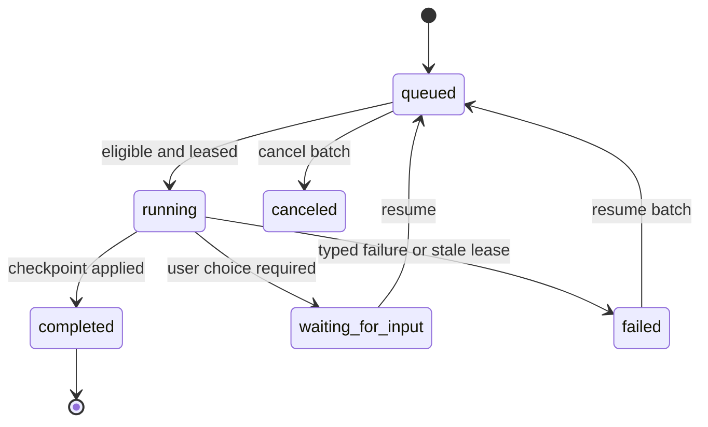

# Import Canonical Sources

This workflow turns a file or URL into a revisioned canonical artifact through the durable ingest queue, then pins that revision into a subject-scoped source set. For the meaning of source, revision, extraction, unit, and set, use [[Canonical Knowledge Model]]; for ownership boundaries, use [[Content Pipeline]].

## Prerequisites

- an initialized vault and an existing subject; see [[Initialize a Vault]]
- an absolute local path or reachable URL
- a ready canonical-ingest provider only if adding `--inventory` or continuing to synthesis

## 1. Import through the durable queue

```bash
VAULT="$HOME/LearnLoop/linear-algebra"
SOURCE="$PWD/research_on_learning.md"

uv run learnloop import "$SOURCE" \
  --subject linear-algebra \
  --json \
  --vault "$VAULT"
```

The JSON response contains a `batch` with an id such as `batch_…`, one or more `jobs` such as `ijob_…`, and a completed import result containing `source_id`, `revision_id`, `extraction_id`, block count, and reuse flags. Save those IDs; later commands intentionally use stable ids rather than path guesses.

When no sidecar worker owns a live lease, the CLI drains its own batch in the foreground. When a desktop/sidecar worker is active, the same durable rows let that worker continue the job.



The durable status is separate from the work checkpoint. A successful full import advances through `acquired → registered → extracted`; inventory/synthesis jobs continue through `inventoried → synthesized → proposed → applied`. Dependencies must complete before downstream jobs become eligible. ^ingest-checkpoints

### Choose the PDF engine

`[ingest.pdf] engine` (Settings → Ingestion → PDF, or the per-import dropdown on the Ingest screen) selects how a PDF becomes text:

| Engine | Where the bytes go | Page ranges |
|---|---|---|
| `auto` | local: Marker when installed, else pypdf | honoured |
| `marker` / `pypdf` | local, forced | honoured |
| `native` | the whole PDF is sent to the `canonical_ingest` chat provider as a file content part | rejected (`invalid_page_range`) |

`native` requires the routed profile to be an OpenAI-compatible chat provider (`openai_chat` or `openrouter`) that declares `pdf` in `input_modalities`; Settings shows the readiness line and, for OpenRouter models, can detect the declaration from the public model catalog (see [[Configure AI Providers#Declare input modalities]]). An unready native route is refused when the batch is started and again by the durable job (`native_pdf_unavailable`, not retried); `[ingest.native] fallback_when_unavailable = true` runs the local engine instead and flags the extraction `native_pdf_fallback_local`. Uploads are capped by `[ingest.native] max_pdf_mb`. The legacy one-shot `learnloop ingest` command has no chat client and rejects `native` rather than downgrading it.

Audio follows the same shape through `[ingest.audio] mode` (`transcription` or `native` for mp3/wav).

## Inspect the batch and extraction

```bash
uv run learnloop ingest-batches list --json --vault "$VAULT"
uv run learnloop ingest-batches show <batch-id> --json --vault "$VAULT"
uv run learnloop source-outline <extraction-id> --json --vault "$VAULT"
```

`source-outline` is deterministic and does not call a model. It reports extractor, token estimate, ordered units, block counts, and extraction health flags.

Observable state after a one-unit Markdown import:

- raw bytes at `canonical-sources/raw/sha256-…`;
- one row each in `source_artifacts`, `source_revisions`, and `source_extraction_runs`;
- ordered rows in `source_document_blocks`;
- batch/job receipts in `ingest_batches` and `ingest_jobs`;
- no `sources/source_sets.yaml` until a source set is created.

## 3. Pin a revision into a source set

```bash
uv run learnloop source-set create learning-science \
  --subject linear-algebra \
  --title "Learning Science" \
  --json --vault "$VAULT"

uv run learnloop source-set add learning-science \
  --source <source-id> \
  --revision <revision-id> \
  --role primary_textbook \
  --unit u1 \
  --json --vault "$VAULT"
```

This creates or updates `sources/source_sets.yaml`. The set pins a specific revision and unit selection so a changing URL cannot silently reinterpret a study map.

> [!important] Provenance invariant
> Always carry the returned `revision_id` into the source set. A source is stable identity; a revision is the exact content used for extraction and synthesis.

## 4. Preview cost and coverage

```bash
uv run learnloop build-plan <extraction-id> \
  --subject linear-algebra --json --vault "$VAULT"

uv run learnloop source-coverage learning-science \
  --json --vault "$VAULT"
```

`build-plan` selects routing/stages and estimates units, calls, and tokens without making the model call. `source-coverage` checks whether the pinned set is ready for synthesis.

Proceed to [[Build a Study Map]].

## Optional paths

### Import and inventory in one batch

```bash
uv run learnloop import "$SOURCE" \
  --subject linear-algebra --inventory --json --vault "$VAULT"
```

This adds provider-backed inventory jobs after extraction. Use it only after [[Configure AI Providers]].

### One-confirmation quick add

```bash
uv run learnloop quick-add "$SOURCE" \
  --subject linear-algebra --yes --json --vault "$VAULT"
```

`quick-add` is the priority shortcut over the same durable pipeline. The deliberate import → inspect → pin path remains preferable when roles, units, or cost need review.

## Resume, cancel, and retry

```bash
uv run learnloop ingest-batches cancel <batch-id> --json --vault "$VAULT"
uv run learnloop ingest-batches resume <batch-id> --json --vault "$VAULT"
```

Resume preserves completed jobs and reruns only unfinished work. Completed revision/extraction hashes are reused; retry does not duplicate canonical history. If a worker dies with a stale lease, recovery marks that attempt `failed` with an interruption code before the user resumes it.

> [!warning] Dependency failures
> A failed, canceled, or blocked upstream job blocks dependent jobs. Inspect the batch rather than submitting a second unrelated import: the original batch preserves checkpoints, accumulated usage, and typed error detail.

## Verified example

[[Deliberate Canonical Import Session]] contains a complete local Markdown run, representative response shape, and read-only SQLite checks.

## Related notes

- [[Canonical Knowledge Model]]
- [[Content Pipeline]]
- [[Build a Study Map]]
- [[Database Catalog]]
