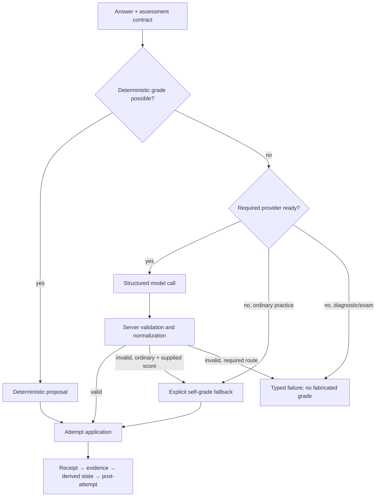

# Process Model Output

LearnLoop never treats a model response as learner state. It resolves the assessment contract, obtains a grading proposal, validates and normalizes it on the server, then sends the accepted grade through one attempt-application path. See [[AI Architecture]] for provider mechanics and [[Learning System]] for how evidence affects mastery.

## End-to-end branch



All accepted paths converge before persistence. Required observations fail closed; they do not silently become self-reports. ^grading-convergence

## 1. Resolve the assessment contract

Before a provider call, the grading service resolves:

- the exact practice item and allowed answer type;
- rubric criteria and maximum points;
- assessment purpose, including diagnostic/exam restrictions;
- reveal-ledger state, which can force an attempt to be primed;
- item/facet identifiers allowed in evidence.

Option-letter items can be graded deterministically. This avoids a model call without weakening the same downstream evidence contract.

## 2. Record the call receipt, then call the provider

For provider-backed grading, an `agent_runs` row is inserted in `running` state before transport begins. The feature sends a typed `GradingContext` and expects a typed `GradingProposal`; transport handles provider protocol and bounded JSON repair as described in [[AI Architecture#Output trust boundary]].

> [!important] Audit invariant
> A timeout, invalid payload, or provider error must still leave an inspectable agent-run outcome. There is no invisible call between the answer and the grade.

## 3. Validate server-side

The validator, not the model:

- verifies attempt and practice-item ids;
- rejects duplicate or unknown rubric criteria;
- enforces each criterion's point bounds;
- recalculates the total from criterion evidence;
- applies fatal-error caps;
- accepts only known facets and criteria;
- recomputes quoted-evidence offsets and safely degrades bad localization;
- rejects structural invalidity rather than guessing.

The model's total is retained for audit, but it does not override the sum of validated criterion points.

## Apply the resolved grade transactionally

`AttemptApplication` materializes the receipt, grade, evidence/error records, derived state inputs, and post-attempt effects before repository persistence. The tested write order is:

1. receipt;
2. grade;
3. criterion evidence and error records;
4. derived learner state;
5. post-attempt effects.

Post-attempt processing schedules qualifying cold probes, stores feedback metadata, and evaluates intervention/causal follow-ups. Exam attempts use the same evidence-side processing but defer feedback until the exam finishes.

## Manual ordinary-practice example

Inspect the item first so criterion ids and maxima come from the live contract:

```bash
VAULT="$HOME/LearnLoop/linear-algebra"
ITEM=pi_what_makes_function_axiom_strategy

uv run learnloop show "$ITEM" --json --vault "$VAULT"

uv run learnloop attempt "$ITEM" \
  --answer "Take scalar a=0 and nonzero f(t)=1; then 0⊙f=f, so the vector-space axiom fails." \
  --criterion-points crit_function_decisive_test=4 \
  --confidence 4 \
  --attempt-type open_text \
  --ai-provider manual \
  --json \
  --vault "$VAULT"
```

The result should identify the new attempt, normalized score/correctness, scheduling update, and `grading_source: "self"` with `fallback_reason: "provider_unavailable"`. Criterion ids are item-specific; never copy the example id to another item.

For the full inspection sequence, use [[Manual Attempt and State Inspection]].

For a ready-provider path that verifies `agent_run_id`, distinguishes success from fallback, and joins the persisted call receipt to criterion evidence, follow [[Provider-Backed Attempt and Agent Run]].

## Failure handling

| Failure | Ordinary practice | Diagnostic, held-out exam, required teach-back grade |
|---|---|---|
| provider unavailable | explicit self-grade if supplied | fail closed |
| timeout/transport error | typed fallback if allowed | fail closed |
| structurally invalid proposal | reject; fallback only if allowed | fail closed |
| bad quote offsets only | retain valid grade, degrade localization | same validation rule |

> [!failure] Evidence inflation trap
> Do not modify adapters to coerce an invalid model total or unknown criterion into a passing grade. Change the feature schema/prompt and validator together, add a regression test, and preserve the failed `agent_runs` receipt.

## Observable state

- raw attempt: `practice_attempts`
- criterion evidence: `grading_evidence`
- call receipt: `agent_runs`
- source/fallback/feedback: `attempt_feedback_metadata`
- derived surprise and learner state: DERIVED-role tables listed in [[Database Catalog]]

Trace them safely in [[Inspect Persistent State#Trace one attempt]].

## Related notes

- [[AI Architecture]]
- [[Learning System]]
- [[State and Persistence]]
- [[Configure AI Providers]]
