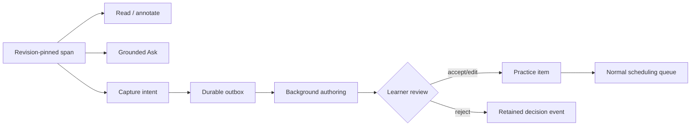

# Reader to Practice Workflow

The Reader turns an already imported, revisioned source into grounded reading, notes, quick checks, and reviewed practice proposals. It does not replace canonical import or silently convert every highlight into learner evidence. Source/revision semantics remain in [[Canonical Knowledge Model]]; generated practice follows [[Learning System]].

> [!info] Surface availability
> Reader is a desktop workflow backed by sidecar handlers. There is no equivalent `learnloop reader` CLI command in mvp-0.9.

## Prerequisites

- a completed extraction from [[Import Canonical Sources]]
- the desired source visible in the desktop Source Library
- a ready `tutor_qa` route for **Ask**, and an authoring route for generated exercises

## 1. Open a stable render view

1. Open **Reader** and select a source from the library.
2. Confirm the revision/extraction shown is the intended completed version.
3. Choose the source-native view when available: embedded original PDF, extracted text, or transcript.
4. Navigate by outline; the current block/span becomes the grounding window for Guide and Ask.

For PDFs, the original bytes remain in the canonical originals store while the extraction supplies page/bounding-box geometry for highlights. Reader progress attaches to the extraction and section, not to a filename that may later change.

## 2. Read with the Guide rail

The Guide rail exposes section progress and a quick check near a section boundary. Complete the check, then choose the section disposition. Progress and completion are stored in `reader_section_progress` so reopening the source restores the same location.

> [!important] Evidence boundary
> Seeing a span is reading telemetry. A quick-check submission can become practice evidence; scrolling alone cannot become mastery evidence.

## 3. Ask a span-grounded question

1. Select text or keep the current span active.
2. Open **Ask**.
3. Choose the answer mode and ask the question.
4. Check the answer's exact source citations.
5. Rate usefulness, save it as a note, or promote it for practice if appropriate.

The backend gates Reader Q&A with `tutor_qa.reader_enabled` and any per-source opt-out. Dialogue/history is durable, but provider architecture and citation validation are owned by [[AI Architecture]].

## 4. Capture source material deliberately

With text selected:

1. Choose **Capture**.
2. Correct OCR/extraction text before saving.
3. Pick a capture kind and relevant tags.
4. For an exercise, preserve the source stem, then review proposed answer, rubric, facets, hints, and depth.
5. Accept, edit, or reject the proposal.

Captures first enter the durable `reader_capture_outbox` with a client idempotency key. Provider-backed work appears in `reader_background_requests`, where it can be retried without duplicate acceptance.



The review node prevents a highlight or model response from bypassing content validation and learner choice. The accepted item joins the normal queue; it is not automatically counted as learned. ^reader-practice-boundary

## 5. Verify durable effects

Supported product checks:

- reopen Reader and confirm restored section/progress;
- inspect the Source Library activity state for queued/completed authoring;
- run `learnloop show <new-practice-item-id> --json --vault <vault>`;
- run `learnloop review --json --vault <vault>` to see whether normal scheduling selects it.

Read-only diagnostic query:

```bash
sqlite3 -readonly "$VAULT/state.sqlite" \
  "SELECT capture_kind, state, attempts, created_at FROM reader_capture_outbox ORDER BY created_at DESC LIMIT 10;"
```

Use [[Database Catalog]] for the complete Reader table inventory and status.

## Failure and retry

- a pending/draining capture remains recoverable from the outbox;
- a background request records typed status, attempts, usage, and error JSON;
- reopening restores source/revision/render view and progress;
- an obsolete revision should be reopened as a new render view, not relabeled in old events.

> [!warning] Source replacement
> Do not edit an existing capture's revision id to point at refreshed bytes. Import the new revision and let new Reader events cite it; old notes and questions retain their historical grounding.

## Next steps

- ask or promote a conceptual question via [[Tutor and Teach-Back Workflow]];
- study accepted items through [[Start a Learning Cycle]];
- diagnose a capture queue via [[Doctor Migrations and Recovery]] only after checking its typed request state.

## Related notes

- [[Canonical Knowledge Model]]
- [[AI Architecture]]
- [[Content Pipeline]]
- [[Learning System]]

