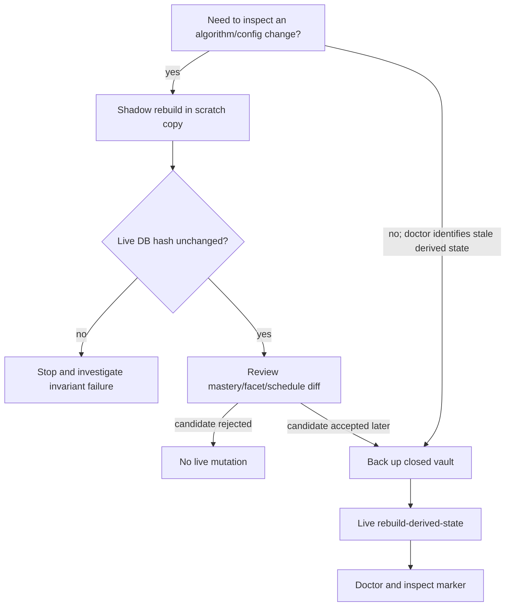

# Rebuild and Shadow Compare

Replay reconstructs derived learner projections from authoritative receipts. A **shadow rebuild** does that in an isolated SQLite copy and compares candidate state; a **live rebuild** clears and rewrites the registered DERIVED tables. Roles and replayability are defined in [[State and Persistence]] and enumerated in [[Database Catalog]].

## Choose the safe branch



Shadow comparison is the default analytical tool. It never promotes a candidate automatically. ^shadow-first

## 1. Run a baseline shadow rebuild

```bash
VAULT="$HOME/LearnLoop/linear-algebra"

uv run learnloop rebuild --shadow --json --vault "$VAULT"
```

The result includes:

- baseline and candidate algorithm versions;
- each replayer and its owned tables;
- raw, replayed, and unaccounted attempt ids/counts;
- mastery, facet, and schedule diffs;
- `live_database.sha256_before`, `sha256_after`, and `unchanged`.

`unchanged` must be `true`. Shadow mode uses SQLite backup into scratch storage and attaches the live database read-only; it neither migrates the live database nor syncs files.

## 2. Compare a supported config candidate

```bash
uv run learnloop rebuild --shadow \
  --set mastery.irt.eb_difficulty_enabled=true \
  --json --vault "$VAULT"
```

`--set dotted.path=value` is repeatable. Overrides are schema-validated before replay and returned in `applied_overrides`. Review individual changes, not only summary counts.

> [!warning] No promotion command
> A favorable shadow diff is evidence for a configuration decision, not permission for the scratch database to replace `state.sqlite`. Edit supported config deliberately, back up the vault, then run a live rebuild.

## 3. Understand what replay owns

The orchestrator runs registered replayers in order:

1. `activity_substrate` prepares authoritative adapters and owns no DERIVED table;
2. `learning_state` owns six derived tables;
3. `canonical_projection` owns three;
4. `identifiability` owns one.

The ten current DERIVED tables are cataloged under their role in [[Database Catalog#DERIVED tables]]. A full replay verifies that every raw attempt is accounted for. It must not clear raw ledgers, receipts, workflow state, or compatibility tables.

## Run a live rebuild only when justified

Stop desktop/sidecar writers and create a full vault backup. Then:

```bash
uv run learnloop doctor --json --vault "$VAULT"

uv run learnloop rebuild-derived-state \
  --json --vault "$VAULT"

uv run learnloop doctor --json --vault "$VAULT"
```

To scope a repair, repeat `--learning-object`:

```bash
uv run learnloop rebuild-derived-state \
  --learning-object <learning-object-id> \
  --json --vault "$VAULT"
```

The stable compatibility payload returns `algorithm_version`, `replayed_attempts`, `rebuilt_learning_objects`, `learning_object_ids`, and `marker_id` when a marker was written. Detailed per-replayer ownership/accounting is exposed by the shadow command, not duplicated in this live command payload. Save both the live result and the preceding shadow report with the incident record.

> [!important] Live-replay invariant
> Rebuild clears and reconstructs only registered DERIVED-role tables, records one marker, and refuses an unaccounted raw attempt. It does not reinterpret source files or delete evidence.

## 5. Inspect the result

```bash
uv run learnloop show <learning-object-id> --json --vault "$VAULT"
uv run learnloop review --limit 5 --json --vault "$VAULT"
```

Compare these supported views with the pre-rebuild snapshot. For provenance-level inspection, use [[Inspect Persistent State]].

## When not to rebuild

- pending SQL migrations → [[Doctor Migrations and Recovery#Repair path]];
- a failed import job → [[Import Canonical Sources#Resume, cancel, and retry]];
- invalid source or item files → fix the content/proposal path;
- a model call failed → [[Process Model Output#Failure handling]];
- a merely surprising queue item → use `why` first.

## Worked drill

[[Recovery and Rebuild Drill]] exercises shadow comparison, backup, and the decision boundary without requiring a live mutation.

## Related notes

- [[State and Persistence]]
- [[Database Catalog]]
- [[Inspect Persistent State]]
- [[Doctor Migrations and Recovery]]
