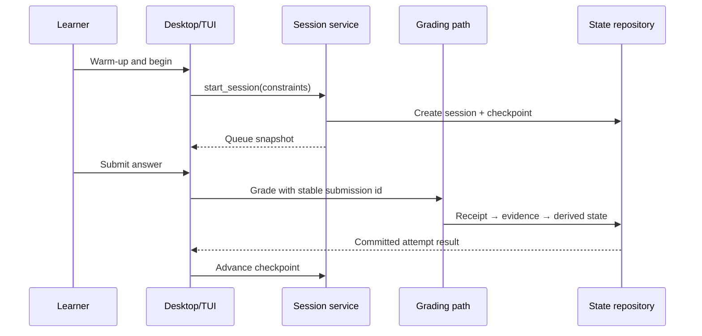

# Start a Learning Cycle

A learning cycle is the repeated session loop: capture current constraints, select eligible work, attempt without contaminating the evidence, grade, write evidence and derived state, then select again. Why these stages exist is explained in [[Learning System]]; queue scoring is owned by [[Scheduling and Selection]].

## Prerequisites

- a healthy vault with applied practice items
- a configured grader, or manual mode for ordinary practice only
- no need to rebuild state before a normal session

Check the surface without writing an attempt:

```bash
VAULT="$HOME/LearnLoop/linear-algebra"

uv run learnloop doctor --json --vault "$VAULT"
uv run learnloop review \
  --limit 3 \
  --available-minutes 20 \
  --energy medium \
  --json \
  --vault "$VAULT"
```

`review` returns an ordered snapshot with practice item ids, selected modes, readiness factor, priority, and reason components. It is useful for automation and inspection; it does not create the full interactive session lifecycle.

## Recommended: start from a session UI

### Desktop

1. Open the vault from the green vault-path control.
2. On **Today**, choose energy, sleep quality, and available minutes.
3. Inspect the queue preview.
4. Select **Begin session**.

The sidecar creates a `sessions` row and an initial `session_checkpoints` row. If another session is still open, starting this one closes it first so there is only one active learning context.

### Terminal UI

```bash
uv run learnloop today --vault "$VAULT"
```

`today` launches an interactive Textual screen; it is not a JSON command. Complete the warm-up fields and begin the session from the screen.

> [!info] Short-session policy
> With the default 20-minute threshold, a short session suppresses due probes when ordinary due work is available. This preserves enough time for useful practice; see [[Scheduling and Selection]] rather than treating it as a missing-item bug.

## For each selected item

1. Read the prompt and answer before revealing hints or expected content.
2. Use the item’s declared answer type; a diagnostic probe may prohibit tutor, hints, or reveal.
3. Submit once. The client holds a stable submission id until it receives the committed result.
4. Review criterion evidence and feedback.
5. Continue to the next queue item or end the session.



The important boundary is the response direction: the UI acknowledges success only after the attempt transaction is recoverable by submission id. Model output alone is not a completed attempt. ^committed-attempt-boundary

## Inspect why an item was selected

From the queue response, take a practice item id:

```bash
uv run learnloop why <practice-item-id> --json --vault "$VAULT"
uv run learnloop show <practice-item-id> --json --vault "$VAULT"
```

`why` explains scheduling components; `show` resolves the item, rubric, and related state. These commands are the first debugging step when a queue item seems surprising.

## Finish and observe

End the session in the active UI. The result distinguishes:

- attempts and items reviewed;
- follow-ups queued;
- cold checks completed and passed;
- streak updates;
- the session learning diff.

The active checkpoint is cleared. The durable attempt/evidence rows remain. See [[Inspect Persistent State]] for read-only checks and [[Continue a Learning Cycle]] for interruption recovery.

> [!warning] Direct CLI attempts
> `learnloop attempt` can record a single attempt and may accept `--session-id`, but the CLI has no separate `start-session` command. Use it for scripting or manual grading, not as a pretend desktop session. See [[Manual Attempt and State Inspection]].

## Related notes

- [[Learning System]]
- [[Scheduling and Selection]]
- [[Process Model Output]]
- [[Continue a Learning Cycle]]

