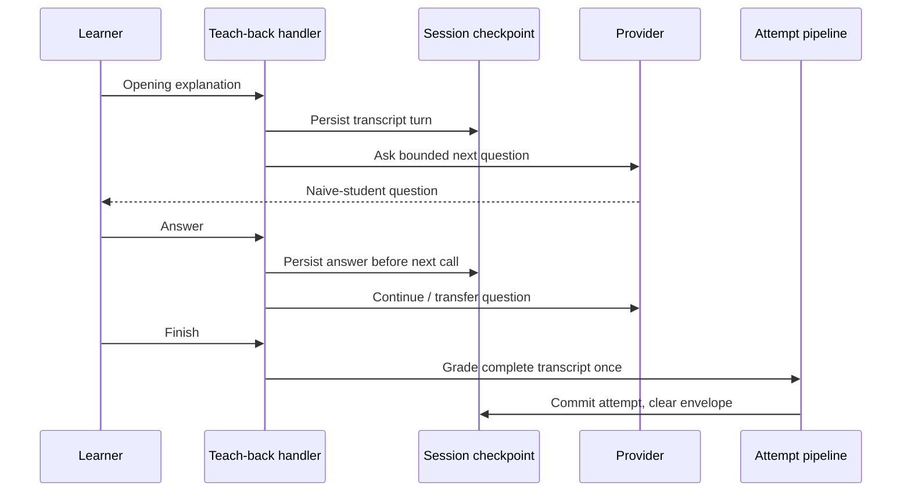

# Tutor and Teach-Back Workflow

Tutor answers a bounded question in the current context. Teach-back asks the learner to explain a topic across a short conversation, then grades the transcript as one attempt. Both use the provider layer in [[AI Architecture]], but only teach-back becomes assessment evidence by completing its grading contract.

> [!info] Surface availability
> These are desktop/sidecar workflows. CLI can configure and diagnose their providers, but does not expose an interactive tutor or teach-back command.

## Tutor Q&A

### Ask

1. From practice, feedback, Library, or Reader, open the **Ask** overlay (`?` where the surface supports it).
2. Confirm the attached context: current item/feedback or source span.
3. Ask one focused question.
4. Inspect cited context and the model answer.
5. Rate whether the answer was useful.

### Turn an answer into durable work

Choose one action:

- **save as note** for explanatory material;
- **promote to practice** when the turn reveals a question worth retrieval;
- **promote as gap** when it exposes missing material.

Promotion is idempotent and reviewable. `question_promotion_requests` and `question_promotions` preserve request/acceptance history; the accepted result enters the usual practice/content contracts instead of writing mastery directly.

> [!warning] Diagnostic firewall
> Active qualifying probes can prohibit tutor, hints, and answer reveal. Do not work around that restriction by opening another surface: contamination would change what the attempt measures. See [[Evidence and Measurement#Assistance, familiarity, and independence]].

## Teach-back conversation

### Readiness

Both the conversation provider and grading provider must be ready:

```bash
uv run learnloop doctor --ai --json --vault "$VAULT"
```

Manual mode cannot grade a teach-back transcript. Items requiring teach-back are filtered from the queue unless both routes can complete the workflow.

### Run the conversation

1. Request **Teach back** from a source item or learning object.
2. LearnLoop resolves or creates a source-scoped teach-back item.
3. Explain the idea in your own words before seeing the learner-model questions.
4. Answer the bounded “naive student” follow-ups, including the transfer question.
5. Finish the conversation.
6. Review the one transcript-level grade and criterion feedback.

Each learner answer is checkpointed before the provider asks the next question. On finish, the complete transcript is recorded as one `attempt_type = teach_back` attempt; the conversation envelope is cleared from `session_checkpoints` after the attempt is committed.



Checkpoint-before-call makes an outage resumable and prevents an unrecorded answer from being required to reconstruct the transcript. ^teach-back-checkpoint-order

## Resume and outage behavior

- Reopen the same active session to restore the transcript envelope.
- If the provider fails between questions, completed turns remain checkpointed.
- At the failure boundary the UI can offer saved retry or, where supported, grading of the partial transcript.
- If grading is unavailable at finish, the transcript remains saved; LearnLoop does not accept a manual criterion total for it.
- Once an attempt is committed, retry by the same submission identity returns that result rather than adding a second teach-back observation.

## Observable state

| Action | Durable observation |
|---|---|
| tutor question/rating | question events and feature interaction receipts |
| promotion | request + promotion records, then reviewed content |
| active teach-back | feature-owned envelope in `session_checkpoints.current_answer` |
| finished teach-back | `practice_attempts`, grading evidence, feedback metadata |

Exact table roles and lifecycle status are cataloged in [[Database Catalog]].

## Modification guidance

- conversation policy and bounds: `src/learnloop/tutor/teach_back.py`;
- wire/sidecar orchestration: `src/learnloop_sidecar/handlers/teach_back.py`;
- tutor grounding and promotion: `src/learnloop/tutor/tutor_qa.py` and promotion services;
- provider schemas/routing: feature AI contracts plus [[AI Architecture]];
- never add feature-specific grading writes around [[Process Model Output#Apply the resolved grade transactionally]].

## Related notes

- [[Reader to Practice Workflow]]
- [[AI Architecture]]
- [[Process Model Output]]
- [[Continue a Learning Cycle]]
